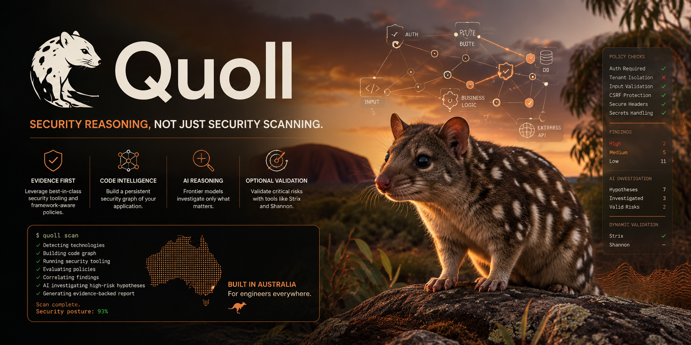

<p align="center">
  
</p>

<h1 align="center">Quoll</h1>

<p align="center">
  <strong>Security reasoning, not just security scanning.</strong><br>
  Built in Australia, for engineers everywhere.
</p>

<p align="center">
  <a href="#status"></a>
  <a href="LICENSE"></a>
  
  
</p>

> The banner above shows the target state. `quoll scan`, policy evaluation and AI
> investigation are not implemented yet — see [Status](#status) for what runs today.

---

A code security scanner that builds a graph of your repository first, and only then decides
what to report.

Most scanners pattern-match a file at a time. That is why they find a `db.execute(...)`
call and cannot tell you whether an unauthenticated stranger can reach it. Quoll indexes
the repository into a persistent code graph, evaluates deterministic framework policies
against that graph, and correlates the result with external scanner output into
*hypotheses* — candidate attacks with the structural evidence attached.

A language model is invited only after that, and only for the hypotheses that clear a
confidence threshold. It reasons about evidence Quoll gathered deterministically; it is
never the thing that decides a vulnerability exists.

> **Status: pre-alpha.** The domain model, plugin contract, code graph and CLI are
> implemented and tested. `quoll graph build` indexes a real repository today; `quoll scan`
> does not exist yet. See [Status](#status) for exactly what works.

---

## Table of contents

- [Why another scanner](#why-another-scanner)
- [How it works](#how-it-works)
- [Status](#status)
- [Commands](#commands)
- [Architecture](#architecture)
- [The code graph](#the-code-graph)
- [Configuration](#configuration)
- [Security boundaries](#security-boundaries)
- [Building and testing](#building-and-testing)
- [Roadmap](#roadmap)
- [Licence](#licence)

---

## Why another scanner


Three problems with the current generation of tools:

**They report per-file matches, not attacks.** A secret in a test fixture and a secret in a
production config are the same finding to a regex. Quoll knows which file is reachable from
an HTTP route and which is not.

**They cannot see missing controls.** No pattern matches the *absence* of an authentication
check. Quoll's policy packs assert invariants over graph structure — "every state-changing
route has a `guarded_by` edge to an auth guard" — so a missing control is a first-class
finding.

**AI-first scanners hallucinate.** Handing a model a repository and asking for
vulnerabilities produces confident, plausible, unverifiable output. Quoll inverts the
order: deterministic analysis produces the evidence, the model reasons about it under a
token budget, and every reported source location is verified against the file on disk
before it reaches a report.

The ordering is expressed numerically. Each evidence source carries a prior weight, in
`quoll-core/src/evidence.rs`:

| Source | Weight |
|---|---|
| Graph — a structural fact proven from the index | 1.0 |
| Dynamic — a runtime observation from a validator | 1.0 |
| Policy — a framework invariant met or violated | 0.9 |
| Scanner — an external tool's rule match | 0.8 |
| History — a fact from repository history | 0.8 |
| Detection — an identified framework or library | 0.7 |
| **AI — a model's reasoning step** | **0.5** |

A model's conclusion is never sufficient on its own. Every AI-derived finding must cite at
least one non-AI item, and that invariant is enforced in code, not in a prompt.

---

## How it works

```
                repository (untrusted input)
                          │
      ┌───────────────────▼────────────────────┐
      │  walk    gitignore, size, binary,       │
      │          symlink and containment        │
      │          guards                         │
      └───────────────────┬────────────────────┘
                          │  only files whose hash changed
      ┌───────────────────▼────────────────────┐
      │  index   tree-sitter → symbols,         │
      │          imports, call sites            │
      └───────────────────┬────────────────────┘
                          │
      ┌───────────────────▼────────────────────┐        ┌──────────────────┐
      │  graph   nodes + edges in SQLite        │◄───────┤ external         │
      │          .quoll/graph.db                │        │ scanners         │
      └───────────────────┬────────────────────┘        │ Semgrep,         │
                          │                             │ Gitleaks, OSV,   │
      ┌───────────────────▼────────────────────┐        │ Trivy, …         │
      │  policy  deterministic invariants       │        └──────────────────┘
      │          per detected framework         │
      └───────────────────┬────────────────────┘
                          │
      ┌───────────────────▼────────────────────┐
      │  correlate  graph + policy + scanner    │
      │             evidence → hypotheses       │
      └───────────────────┬────────────────────┘
                          │  only above the confidence threshold
      ┌───────────────────▼────────────────────┐
      │  investigate  bounded evidence bundle   │
      │               → model → verdict         │
      └───────────────────┬────────────────────┘
                          │
                  JSON · SARIF · Markdown
```

Everything above the "investigate" step runs with no API key, no network and no model
calls. A repository with no qualifying hypotheses costs zero tokens.

### Scan profiles

| Profile | What runs |
|---|---|
| `fast` | Graph update, policy checks, Semgrep, Gitleaks, OSV. No LLM, no dynamic testing. |
| `balanced` | `fast`, plus hypothesis correlation, investigation of qualifying hypotheses, model-written reporting. |
| `deep` | `balanced`, plus a full-repository scan, Trivy and language-specific tools, optional dynamic validation, higher model limits. |
| `release` | `deep` against a staging target, with dynamic validation enabled only by explicit configuration. |

---

## Status

Pre-alpha. Four of eleven crates are implemented; **194 unit tests pass** and the workspace
is clippy-clean.

| Crate | State | Contents |
|---|---|---|
| `quoll-cli` | **Implemented** | The `quoll` binary: argument parsing, terminal output and exit-code mapping. Holds no business logic. |
| `quoll-core` | **Implemented** | Domain vocabulary: severity, confidence, evidence, findings, hypotheses, locations, tech stack, and the `quoll.toml` loader. Depends on no scanner, no AI provider and no storage engine. |
| `quoll-plugin` | **Implemented** | The plugin contract: manifests, capability negotiation, scan context, registry and scheduling, plus the single choke point for subprocess execution. |
| `quoll-graph` | **Implemented** | File discovery, tree-sitter indexing, the SQLite code graph, and bounded traversal. |
| `quoll-detect` | Not started | Language, framework, ORM, auth-library and CI-provider detection from manifests and imports. |
| `quoll-plugins` | Not started | First-party adapters: Semgrep, Gitleaks, OSV-Scanner, Trivy, cargo-audit, Strix. |
| `quoll-policy` | Not started | YAML policy packs and deterministic invariant evaluation. |
| `quoll-engine` | Not started | Scan orchestration, finding normalisation, hypothesis correlation, and CI integration. |
| `quoll-ai` | Not started | Provider adapters, role-based model routing, hard budgets, investigation caching. |
| `quoll-report` | Not started | JSON, SARIF and Markdown output with source-location verification. |
| `quoll-mcp` | Not started | Compact read-oriented MCP tools. |

### What already works, end to end

```console
$ cargo install --path crates/quoll-cli
$ cd ~/code/my-app

$ quoll init
✓ wrote /Users/me/code/my-app/quoll.toml
  profile                balanced
  graph                  .quoll/graph.db
  ai                     disabled

$ quoll graph build
Building /Users/me/code/my-app

Files
  discovered             412
  parsed                 388
  unchanged              0
  no grammar             24 (recorded, not parsed)

Written this run
  symbols                1841
  nodes                  2277
  edges                  4130
  elapsed                2.4s

Not indexed
  over size limit        3
  binary                 11
  ambiguous calls        207 (no edge written)
✓ graph at /Users/me/code/my-app/.quoll/graph.db

$ quoll graph update
Files
  discovered             412
  parsed                 2
  unchanged              410
```

Re-running against an unchanged tree reparses nothing: file hashes are compared first, and
only files whose contents changed are handed to tree-sitter.

The same thing from Rust:

```rust
use quoll_graph::{Graph, GraphOps, Indexer, NodeKind, Walker};

let mut graph = Graph::open(".quoll/graph.db")?;
let report = Indexer::new(Walker::new(".")).index(&mut graph, "scan-1")?;
println!("{}", report.summary());

for route in graph.nodes_of_kind(NodeKind::Route)? {
    println!("{} at {}", route.name, route.location_label());
}
```

---

## Commands

| Command | State |
|---|---|
| `quoll init` | **Works** — writes a `quoll.toml` generated from the defaults |
| `quoll graph build` | **Works** — indexes from scratch |
| `quoll graph update` | **Works** — indexes only what changed |
| `quoll graph stats` | **Works** — node, edge and file counts by kind |
| `quoll doctor` | **Works** — configuration, graph, state directory, grammars, scanner binaries |
| `quoll plugins list` \| `doctor` | **Works** — reports an empty registry until the adapters land |
| `quoll scan` \| `ci` \| `explain` \| `findings` | Pending `quoll-engine` |
| `quoll investigate` | Pending `quoll-ai` |
| `quoll validate` | Pending `quoll-plugins` |
| `quoll export` | Pending `quoll-report` |
| `quoll policy` | Pending `quoll-policy` |
| `quoll mcp` | Pending `quoll-mcp` |

A pending command names the crate it is waiting on and exits `70`, which no scan outcome
uses. An unbuilt command and a broken one must never look the same, and a CI pipeline
pointed at a pre-alpha build must fail loudly rather than report a clean scan.

### Exit codes

These are a public interface. Values are fixed and are never reassigned.

| Code | Meaning |
|---|---|
| `0` | Policy passed |
| `1` | Findings at or above the severity gate |
| `2` | Invalid configuration |
| `3` | An external scanner failed or timed out |
| `4` | Graph indexing failed |
| `5` | A required model invocation failed |
| `6` | A token, call or byte budget was exhausted |
| `7` | Dynamic validation was requested against a forbidden target |
| `70` | The command is not implemented in this build |
| `71` | Internal error |

Global flags — `-C/--path`, `--config`, `-q/--quiet`, `-v/--verbose`, `--no-color` — work
before or after the subcommand. Logs go to stderr; stdout is reserved for results.
`RUST_LOG` overrides `--verbose`.

---

## Architecture

A Cargo workspace on stable Rust (MSRV 1.82), resolver 2.

```
quoll/
├── Cargo.toml            workspace manifest and the crate map
└── crates/
    ├── quoll-cli/        the `quoll` binary: parsing, output, exit codes
    ├── quoll-core/       domain vocabulary, configuration, errors
    ├── quoll-plugin/     plugin contract, process execution, registry
    ├── quoll-graph/      walk · parse · store · query
    ├── quoll-detect/     framework and technology detection
    ├── quoll-plugins/    first-party scanner adapters
    ├── quoll-policy/     policy packs and invariant evaluation
    ├── quoll-engine/     orchestration, normalisation, correlation, CI
    ├── quoll-ai/         model providers, routing, budgets
    ├── quoll-report/     JSON, SARIF, Markdown
    └── quoll-mcp/        MCP server
```

The dependency direction is strict: `quoll-core` depends on nothing in the workspace, and
`quoll-plugin` depends only on `quoll-core`. Adding Semgrep, CodeQL or a tool that does not
exist yet requires no change to the orchestrator.

`quoll-cli` holds no business logic. Anything that decides what a scan *means* lives in a
library crate, so the same behaviour is reachable from the MCP server and from tests
without spawning a subprocess.

The crate list consolidates several crates named in the design specification —
configuration lives in `quoll-core`, and the runner, normaliser, hypothesis engine and CI
integration are all `quoll-engine`. The full mapping and the reasoning behind it are
recorded as a comment in the workspace `Cargo.toml`.

---

## The code graph

Stored at `.quoll/graph.db`: one SQLite file, schema versioned through `PRAGMA
user_version`. Opening a database written by a newer Quoll is a hard error rather than a
best-effort read, because a silently-ignored column produces a graph that is wrong instead
of one that is merely missing.

### Node kinds

`repository` · `package` · `file` · `module` · `function` · `method` · `route` ·
`middleware` · `auth_guard` · `authorisation_guard` · `database_operation` ·
`database_table` · `external_request` · `filesystem_operation` · `process_execution` ·
`secret` · `dependency` · `scanner_finding` · `security_control`

### Edge kinds

`contains` · `imports` · `defines` · `calls` · `routes_to` · `guarded_by` ·
`authenticates` · `authorises` · `reads` · `writes` · `queries` · `flows_to` ·
`depends_on` · `finding_at` · `supports` · `evidence_for`

Both lists are closed. An open string kind would let every plugin invent its own
vocabulary, and policy packs would then match on spelling rather than on meaning.

### Node identity

Node ids are content-derived strings (`route-a3f01c9e2b4d5f60`), not row ids. Identity has
to survive a database rebuild, be quotable from a policy pack, and come out identical on
two machines that indexed the same commit. Row ids satisfy none of those.

### Two properties that are load-bearing

**Bounded.** Every traversal is capped on depth, visited nodes and returned paths, and
reports whether a cap was hit. A repository is untrusted input and must never be able to
make a scan hang. Containment and evidence edges are excluded from traversal entirely —
they connect everything to everything, and following them would turn a bounded walk into a
scan of the whole table.

**Honest.** Call edges are resolved by name, and only when the target is unambiguous: a
callable in the same file wins, otherwise a single callable with that name anywhere in the
repository, otherwise nothing. Two `execute` methods in different modules are not evidence
that a caller reaches either of them, and a guessed edge would put a fabricated attack path
in a report. Unresolved call sites are counted in the index report, never invented.

Quoll does **not** perform whole-program taint analysis or complete interprocedural
data-flow analysis, and does not claim to.

### Supported languages

| Language | Structural indexing |
|---|---|
| Rust | Yes |
| TypeScript, TSX | Yes |
| JavaScript | Yes |
| Python, Go, Java, Ruby, PHP, C# | Grammar available, extraction rules not yet written |

Adding a language is a table entry in `parse.rs` plus a name-extraction case, not a new
traversal.

### Incremental indexing

The whole index runs as one SQLite transaction. A partially indexed graph is worse than an
unchanged one: policy evaluation would see a route whose guard has not been written yet and
report a missing control that exists.

One consequence is worth stating plainly. An incremental run resolves call sites only for
the files it parsed. If an unchanged file calls a symbol introduced by a new file, that
edge appears on the next full rebuild rather than immediately.

---

## Configuration

Every field has a defensible default, so `quoll scan` works on a repository with no
configuration at all. `quoll.toml` exists to override, never to enable.

```toml
[scan]
profile = "balanced"
exclude = ["**/node_modules/**", "**/target/**"]
max_file_size_kb = 2048
respect_gitignore = true

[graph]
enabled = true
path = ".quoll/graph.db"

[ai]
enabled = false            # off unless switched on; no keys, no network

[ai.models.investigator]
provider = "openai"
effort = "high"
max_calls = 3
max_input_tokens_total = 90000
max_output_tokens_total = 18000

[ai.models.reporter]
effort = "low"
max_calls = 12
max_input_tokens_total = 50000
max_output_tokens_total = 12000
```

The investigator and reporter split is the point. A strong model reasons about whether a
hypothesis is real; a cheap model writes the prose. The cheap model is never asked to
decide whether a vulnerability exists, and cannot alter a verdict, a severity or a piece of
evidence.

---

## Security boundaries

Quoll treats every repository it scans as hostile input. It must never:

- execute repository source code;
- run package install hooks or build scripts;
- invoke external tools through a shell — every subprocess is spawned directly, with an
  argument vector, a working directory and an environment allowlist;
- follow symlinks, or read a path that resolves outside the repository root;
- persist API keys, or send secrets to a model;
- run dynamic validation against a production target;
- trust a model-generated source location without verifying it against the file on disk.

Every subprocess has a timeout, and its process tree is killed when that timeout fires.
These are not aspirations: the containment check, the symlink refusal, the timeout kill and
the shell-free spawn each have a test.

---

## Building and testing

Requires stable Rust 1.82 or newer. No system SQLite is needed — `rusqlite` is built with
the bundled library.

```bash
cargo build --workspace
cargo test --workspace
cargo clippy --workspace --all-targets

# Install the binary
cargo install --path crates/quoll-cli
```

Expect 194 passing unit tests and no clippy warnings. The tests need no network access and
no API key.

---

## Roadmap

**Toward a runnable MVP**

- [x] Domain vocabulary and configuration
- [x] Plugin contract, registry and shell-free process execution
- [x] Code graph: walk, incremental tree-sitter indexing, SQLite storage, bounded traversal
- [x] `quoll-cli` — the binary, with `init`, `graph`, `plugins` and `doctor` working
- [ ] Framework detection: Next.js App Router, Better Auth, Drizzle, Prisma, Express, Axum, Actix Web
- [ ] Policy packs and deterministic invariant evaluation
- [ ] Scanner adapters: Semgrep, Gitleaks, OSV-Scanner, cargo-audit
- [ ] Finding normalisation and deduplication into one schema
- [ ] Hypothesis correlation
- [ ] Model providers, role routing and hard budgets
- [ ] JSON, SARIF and Markdown reporting with verified source locations
- [ ] GitHub Actions integration and stable exit codes

**Explicitly out of scope for the MVP**

A web dashboard, multi-user server mode, distributed workers, PostgreSQL storage, complete
taint analysis, automatic source-code fixes, a Kubernetes controller, and hosted SaaS.

---

## Licence

Apache-2.0. See [LICENSE](LICENSE).
